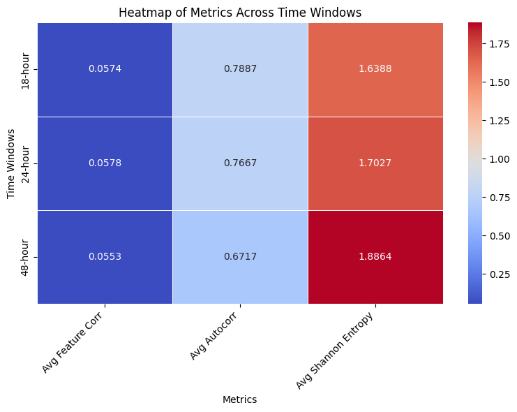
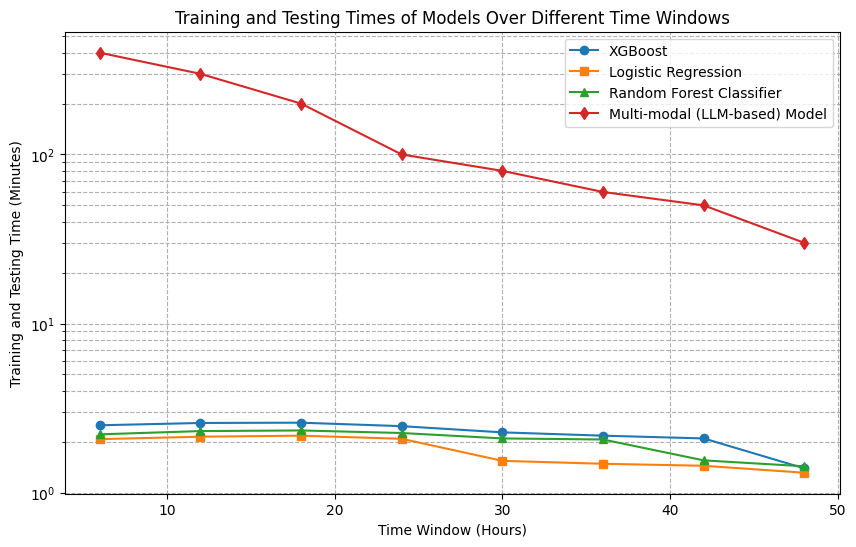

<p align="center">
    <h1 align="center">
        When Simpler Is Better: Traditional Models Outperform LLMs in ICU Mortality Prediction
    </h1>
     <p>This study compares traditional machine learning models to a multi-modal LLM-based model for predicting ICU mortality using the MIMIC-III dataset. We test several time windows (6, 12, 18, 24, and 48 hours) after admission. The results show that traditional models, especially Random Forest, consistently perform better and are more efficient than the LLM-based model. Our analysis finds that higher feature correlation, steady data patterns, and balanced variability lead to better predictions. While LLMs have potential, their current complexity and longer training times make them less practical without careful data selection and preparation. These findings highlight the importance of choosing both the right model and the right time windows to achieve reliable ICU mortality predictions.</p>
</p>


## Pretraining Multimodal Mimic

<p align="center">
  
  
  
</p>

<p align="center">
  
  
  
</p>


## Fine-tuning Multimodal Mimic for the Downstream Task
<p align="center">
  
  
  
</p>

<p align="center">
  
  
  
</p>


# Dataset

Please check [document of dataset](./documents/dataset.md)

<p align="center">
  
</p>


# Training

We utilize a customized development container (devcontainer) to conduct all experiments within an isolated environment. This approach ensures consistency across development setups and mitigates issues related to Python dependencies. 

Different models have different training strategies, please check below:

<p align="center">
  
</p>


## Training Customized LLM

For training the customized LLM model. Please use `tmux`

```
tmux new -s session_name
tmux ls
tmux a -t session_name
time python experiments/measurement_notes/measurement_notes_llm.py > train_log.txt 2>&1
Control+B D

tail -f train_log.txt
```

## Training Traditional Models

For training the traditional ML model, please use [Makefile](./Makefile).


# Developer

The entire project structure should be like below:

```
ubuntu@ip:~/workspace/multimodal-mimic3-pretraining-epoch200$ tree -L 2
.
├── CITATION.cff
├── Makefile
├── README.md
├── README_MODEL_ARCH.md
├── READM_log.md
├── cost-time.md
├── documents
│   └── dataset.md
├── exp
│   └── in-hospital-mortality
├── exp_outputs
│   └── multimodal-mimic-3-pretraining-epoch-200
├── experiments
│   └── measurement_notes
├── imgs
│   ├── W&B Chart 3_3_2025, 11_24_37 am.png
│   ├── W&B Chart 3_3_2025, 11_27_50 am.png
│   ├── W&B Chart 3_3_2025, 11_28_12 am.png
│   ├── W&B Chart 7_3_2025, 10_34_54 am.png
│   ├── W&B Chart 7_3_2025, 10_35_12 am.png
│   ├── W&B Chart 7_3_2025, 10_35_33 am.png
│   ├── W&B Chart 7_3_2025, 10_35_44 am.png
│   ├── W&B Chart 7_3_2025, 10_50_50 am.png
│   ├── W&B Chart 7_3_2025, 10_53_57 am.png
│   ├── W&B Chart 7_3_2025, 10_58_50 am.png
│   ├── W&B Chart 7_3_2025, 10_58_57 am.png
│   ├── W&B Chart 7_3_2025, 10_59_02 am.png
│   ├── result_of_evaluation_ds.png
│   └── training_time.png
├── in-hospital-mortality-12
│   ├── test
│   ├── test_listfile.csv
│   ├── train
│   ├── train_listfile.csv
│   └── val_listfile.csv
├── in-hospital-mortality-18
│   ├── test
│   ├── test_listfile.csv
│   ├── train
│   ├── train_listfile.csv
│   └── val_listfile.csv
├── in-hospital-mortality-24
│   ├── test
│   ├── test_listfile.csv
│   ├── train
│   ├── train_listfile.csv
│   └── val_listfile.csv
├── in-hospital-mortality-30
│   ├── 1percent_test_listfile.csv
│   ├── 1percent_train_listfile.csv
│   ├── 1percent_val_listfile.csv
│   ├── test
│   └── train
├── in-hospital-mortality-36
│   ├── 1percent_test_listfile.csv
│   ├── 1percent_train_listfile.csv
│   ├── 1percent_val_listfile.csv
│   ├── test
│   └── train
├── in-hospital-mortality-42
│   ├── 1percent_test_listfile.csv
│   ├── 1percent_train_listfile.csv
│   ├── 1percent_val_listfile.csv
│   ├── test
│   └── train
├── in-hospital-mortality-48
│   ├── test
│   ├── test_listfile.csv
│   ├── train
│   ├── train_listfile.csv
│   └── val_listfile.csv
├── in-hospital-mortality-6
│   ├── test
│   ├── test_listfile.csv
│   ├── train
│   ├── train_listfile.csv
│   └── val_listfile.csv
├── in-hospital-mortality-6-48.tar.gz
├── logs
│   ├── 12h_log_5_dec.txt
│   ├── 18h_log_5_dec.txt
│   ├── 24h_log_5_dec.txt
│   ├── down_stream_48h_log.txt
│   ├── fine_tuning_on_48_h_log.txt
│   ├── fine_tuning_on_6_h_log.txt
│   ├── pretrain_log.txt
│   ├── requirements.txt
│   ├── train_log.txt
│   ├── train_log_12_600.txt
│   ├── train_log_18_600.txt
│   ├── train_log_24_600.txt
│   ├── train_log_28_Feb.txt
│   ├── train_log_30_1800.txt
│   ├── train_log_30_600.txt
│   ├── train_log_30_900.txt
│   ├── train_log_36_1800.txt
│   ├── train_log_36_600.txt
│   ├── train_log_36_900.txt
│   ├── train_log_42_600.txt
│   ├── train_log_48_0_600.txt
│   ├── train_log_48_600.txt
│   ├── train_log_5_dec.txt
│   ├── train_log_6_600.txt
│   ├── train_log_6_hours_600.txt
│   ├── train_log_n_12_600.txt
│   ├── train_log_n_18_600.txt
│   ├── train_log_n_24_600.txt
│   ├── train_log_n_30_600.txt
│   ├── train_log_n_36_600.txt
│   ├── train_log_n_42_600.txt
│   ├── train_log_n_48_600.txt
│   ├── train_log_n_6_10.txt
│   ├── train_log_n_6_600.txt
│   ├── train_log_p_12_600.txt
│   ├── train_log_p_18_600.txt
│   ├── train_log_p_24_600.txt
│   ├── train_log_p_30_600.txt
│   ├── train_log_p_36_600.txt
│   ├── train_log_p_42_600.txt
│   ├── train_log_p_48_2_600.txt
│   ├── train_log_p_48_600.txt
│   ├── train_log_p_6_600.txt
│   ├── train_log_p_n_12_600.txt
│   ├── train_log_p_n_18_600.txt
│   ├── train_log_p_n_24_600.txt
│   ├── train_log_p_n_30_600.txt
│   ├── train_log_p_n_36_600.txt
│   ├── train_log_p_n_42_600.txt
│   ├── train_log_p_n_6_600.txt
│   └── train_logs_48_24_nov.txt
├── mimic3-benchmarks
│   ├── create_decompensation.py
│   ├── create_in_hospital_mortality.py
│   ├── create_length_of_stay.py
│   ├── create_multitask.py
│   ├── create_phenotyping.py
│   ├── extract_episodes_from_subjects.py
│   ├── in-hospital-mortality
│   ├── in-hospital-mortality-downstream
│   └── root
├── multimodal_clinical_pretraining
│   ├── __init__.py
│   ├── __pycache__
│   ├── data
│   ├── distributed_utils.py
│   ├── loss.py
│   ├── models
│   ├── optim
│   ├── pretrain
│   ├── resources
│   ├── scheduler
│   └── utils.py
├── raw-mimic3
│   ├── ICUSTAYS.csv
│   └── NOTEEVENTS.csv
├── scripts
│   └── calculate_execution_time.sh
├── test_notes_dataset.pkl
├── train_notes_dataset.pkl
├── val_notes_dataset.pkl
├── visualization
│   ├── eval_aoc_roc.ipynb
│   └── newplot.png
└── wandb
    ├── debug-internal.log -> run-20250304_100151-bqulgoqf/logs/debug-internal.log
    ├── debug.log -> run-20250304_100151-bqulgoqf/logs/debug.log
    ├── latest-run -> run-20250304_100151-bqulgoqf
    ├── run-20250302_051114-nnfq92sr
    ├── run-20250302_231213-6odzmeub
    ├── run-20250302_231826-g8u7nzsm
    ├── run-20250304_025141-5o65hj3j
    ├── run-20250304_045655-v46aka9n
    ├── run-20250304_061911-c5pnhukq
    ├── run-20250304_062932-t2zgvzww
    ├── run-20250304_064307-m5ss0f6h
    ├── run-20250304_064926-em2k41io
    ├── run-20250304_070123-fcbuonjr
    ├── run-20250304_070611-stzzyoax
    ├── run-20250304_071730-t5s3jpn9
    ├── run-20250304_072430-6jpgoob4
    ├── run-20250304_073736-32tqbycx
    ├── run-20250304_074443-13w4jjnl
    ├── run-20250304_075835-o3mnqra5
    ├── run-20250304_084711-z0on6zav
    └── run-20250304_100151-bqulgoqf

69 directories, 117 files
```


# Citation

```bibtex
@software{Li_Multimodal-mimic_2024,
author = {Li, Bowen},
doi = {<>},
month = dec,
title = {{Multimodal-mimic}},
url = {https://github.com/Aisuko/multimodal-mimic},
version = {1.0.0},
year = {2024}
}
```


# Acknowledgements

* [Ryan King etc al.](https://github.com/kingrc15/multimodal-clinical-pretraining)
* [YerevaNN](https://github.com/YerevaNN/mimic3-benchmarks)

Thanks for your contribution.
